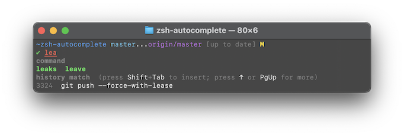
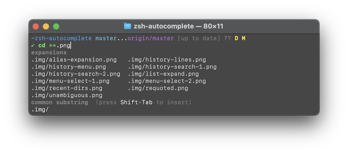

# `zsh-autocomplete`
`zsh-autocomplete` adds **real-time type-ahead autocompletion** to Zsh, plus many more completion
features.

[](https://asciinema.org/a/356653)

* [Features](#features)
* [Key Bindings](#key-bindings)
* [Requirements](#requirements)
* [Installation](#installation)
* [Preferences](#preferences)
* [Author](#author)
* [License](#license)

# Features

* Recent dirs completion:

  
  * Supports `cdr`, `zsh-z`, `zoxide`, `z.lua`, `rupa/z.sh`, `autojump` and `fasd`.

* Automatic incremental history search:

  

* History menu ([<kbd>↑</kbd>](# "up")):

  |  |  |
  | --- | --- |

  * Does history search when buffer is non-empty:

    |  |  |
    | --- | --- |

* Multi-selection ([<kbd>⇥</kbd>](# "tab")) in completion menu ([<kbd>↓</kbd>](# "down")) and
  history menu:

  |  |  |
  | --- | --- |
  * Single selection in menus with [<kbd>↩︎</kbd>](# "enter").

* Context-sensitive completions:
  * Alias expansions

    

  * Alternative quoting

    

  * Common substrings

    

* Hidden completions can be revealed with [<kbd>⇤</kbd>](# "shift-tab").

  


# Key Bindings
| Key(s) | Action | <sub>[Widget](#advanced-choose-your-own-key-bindings)</sub> |
| --- | --- | --- |
| any | Show completions (asynchronously) | <sub>`_list_choices`</sub> |
| [<kbd>⇥</kbd>](# "tab") | Insert top completion | <sub>`complete-word`</sub> |
| [<kbd>⇤</kbd>](# "shift-tab") | Insert bottom completion | <sub>`expand-word`</sub> |
| [<kbd>↓</kbd>](# "down") | Open completion menu or move cursor down (in multi-line buffer) | <sub>`down-line-or-select`</sub> |
| [<kbd>⇟</kbd>](# "page down") | Open completion menu (always) | <sub>`menu-select`</sub> |
| [<kbd>↑</kbd>](# "up") | Open history menu or move cursor up (in multi-line buffer) | <sub>`up-line-or-search`</sub> |
| [<kbd>⇞</kbd>](# "page up") | Open history menu (always) | <sub>`history-search`</sub> |
| [<kbd>⌃</kbd><kbd>␣</kbd>](# "ctrl-space") | Reveal hidden completions and additional info | <sub>`list-expand`</sub> |

## Completion Menu
| Key(s) | Action |
| --- | --- |
| [<kbd>↑</kbd><kbd>↓</kbd><kbd>←</kbd><kbd>→</kbd>](# "arrow keys") | Change selection |
| [<kbd>↩︎</kbd>](# "enter") | Accept and exit |
| [<kbd>⌥</kbd><kbd>␣</kbd>](# "alt-space") | Multi-select |
| [<kbd>⌃</kbd><kbd>␣</kbd>](# "ctrl-space") | Reveal hidden completions and additional info |
| [<kbd>↖︎</kbd>](# "home") | Beginning of line |
| [<kbd>↘︎</kbd>](# "end") | End of line |
| [<kbd>⇞</kbd>](# "page up") | Page up |
| [<kbd>⇟</kbd>](# "page down") | Page down |
| [<kbd>⌥</kbd><kbd>b</kbd>](# "alt-b") | Backward one group (if groups are shown) |
| [<kbd>⌥</kbd><kbd>f</kbd>](# "alt-f") | Forward one group (if groups are shown) |
| [<kbd>⌥</kbd><kbd><</kbd>](# "alt-<") | Beginning of menu |
| [<kbd>⌥</kbd><kbd>></kbd>](# "alt->") | End of menu |
| other | Accept selection and exit menu (then execute the key just typed) |

## History Menu
| Key(s) | Action |
| --- | --- |
| [<kbd>↑</kbd><kbd>↓</kbd>](# "up or down") | Change selection |
| [<kbd>↩︎</kbd>](# "enter") | Accept and exit menu |
| [<kbd>⌥</kbd><kbd>␣</kbd>](# "alt-space") | Multi-select |
| [<kbd>⌥</kbd><kbd><</kbd>](# "alt-<") | Beginning of menu |
| [<kbd>⌥</kbd><kbd>></kbd>](# "alt->") | End of menu |
| other | Accept and exit menu (then execute the key just typed) |

# Requirements
Recommended:
* **[Zsh](http://zsh.sourceforge.net) 5.8** or later.

Minimum:
* Zsh 5.3 or later.


# Installation
1. `git clone` this repo. (You can optionally use a plugin manager for this.)
1. Add the following to your `.zshrc` file:
   ```shell
   source path/to/zsh-autocomplete.plugin.zsh
   ```

## Updating
1. `cd` into `zsh-autocomplete`'s directory.
1. Do `git pull`.

(Or use your plugin manager's update mechanism).

## As a Plugin
`zsh-autocomplete` should work as a plugin with most frameworks & plugin managers. Please refer to
your framework's/plugin manager's documentation for instructions.

Note for Oh My Zsh, Prezto and Zimfw users: `zsh-autocomplete` works best if you use it
_instead_ of your framework's supplied completion module.


# Preferences
The behavior of `zsh-autocomplete` can be customized through the `zstyle` system.

## Wait for a minimum amount of input
By default, `zsh-autocomplete` will show completions as soon as you start typing.

To make it stay silent until a minimum number of characters have been typed:
```shell
zstyle ':autocomplete:list-choices:*' min-input 3
```

## Shorten or lengthen the autocompletion list
By default, `zsh-autocomplete` limits the amount of automatically listed completions to 50% of
[`$LINES`](http://zsh.sourceforge.net/Doc/Release/Parameters.html#Parameters-Used-By-The-Shell)
minus
[`$BUFFERLINES`](http://zsh.sourceforge.net/Doc/Release/Zsh-Line-Editor.html#User_002dDefined-Widgets)
to prevent the prompt from jumping around too much while you are typing.

To limit the list to a different height, use the following:
```shell
zstyle ':autocomplete:list-choices:*' max-lines 100%
```
You can set this to a percentage or to a fixed number of lines. Both work.

## Always show matches in named groups
By default, completion groups and duplicates matches are shown only in certain circumstances or
when you press [<kbd>⇤</kbd>](# "shift-tab"). This allows the automatic listing of completion
matches to be as compact and fast as possible.

To always show matches in groups (and thus show duplicate matches, too):
```shell
zstyle ':autocomplete:*' groups always
```
**WARNING:** Enabling this setting can significantly decrease responsiveness.

## Customize the autocompletion messages
You can customize the various completion messages shown.

This is shown when the number of lines needed to display all completions exceeds the number given
by
[`zstyle ':autocomplete:list-choices:*' max-lines`](#shorten-or-lengthen-the-autocompletion-list):
```shell
zstyle ':autocomplete:*:too-many-matches' message \
  '%F{yellow}Too long list. Press %B$ctrl-space%b %F{yellow}to open or type more to filter.'
```

This is shown when, for the given input, the completion system cannot find any matching completions
at all:
```shell
zstyle ':autocomplete:*:no-matches-at-all' message 'No matching completions found.'
```

## Change <kbd>⇥</kbd> and <kbd>⇤</kbd> behavior
By default, [<kbd>⇥</kbd>](# "tab") accepts the top match. The idea is that you keep typing until
the match you want is
* _at_ the top, at which point you press [<kbd>⇥</kbd>](# "tab") to accept it immediately, or
* _near_ the top, at which point you press [<kbd>⌃</kbd><kbd>␣</kbd>](# "ctrl-space") or (with
`fzf`) [<kbd>↓</kbd>](# "down") to start menu selection. Then, inside the menu, use
  * [<kbd>↑</kbd><kbd>←</kbd><kbd>↓</kbd><kbd>→</kbd>](# "arrow keys") to navigate the menu,
  * [<kbd>↩︎</kbd>](# "enter") to accept a single match,
  * [<kbd>⇥</kbd>](# "tab") to accept multiple matches, and
  * [<kbd>⇤</kbd>](# "shift-tab") to reveal hidden matches/info (which also works from the command
    line).

However, several alternative behaviors are available. The three settings for these (`widget-style`,
`insert-unambiguous` and `fzf`) can be combined.

To first insert any shared substrings, before completing entire words:
```shell
zstyle ':autocomplete:tab:*' insert-unambiguous yes
```

To use menu selection:
```shell
zstyle ':autocomplete:tab:*' widget-style menu-select
```

To cycle completions without using menu selection:
```shell
zstyle ':autocomplete:tab:*' widget-style menu-complete
```

To try Fzf's completion before using Zsh's completion:
```shell
zstyle ':autocomplete:tab:*' fzf yes
```

## Disable recent dirs completion
`zsh-autocomplete` will automatically list recent directories from your favorite directory jumping
tool, provided you have it set up to track your directory changes.

To _not_ include recent dirs in your completions:
```shell
zstyle ':autocomplete:*' recent-dirs off
```

## Advanced: Choose your own key bindings
`zsh-autocomplete` includes a set of intuitive [keyboard shortcuts](#key-bindings), mimicking those
offered by most IDEs. However, some users have their own very customized set of key bindings, into
which the defaults might not fit in.

To disable the default key bindings:
```shell
zstyle ':autocomplete:*' key-binding off
```

You can then use `zsh-autocomplete`'s [widgets](#key-bindings) to define your own key bindings.

## Advanced: Use your own completion config
`zsh-autocomplete` comes preconfigured with its own set of sophisticated completion settings, to
ensure you have the best possible out-of-the-box experience. However, some users might prefer to
build their own suite of completion settings, to fully customize the experience.

To disable the pre-packaged config:
```shell
zstyle ':autocomplete:*' config off
```

# Author
© 2020 [Marlon Richert](https://github.com/marlonrichert)

# License
This project is licensed under the MIT License. See the
[LICENSE](/marlonrichert/zsh-autocomplete/LICENSE) file for details.
